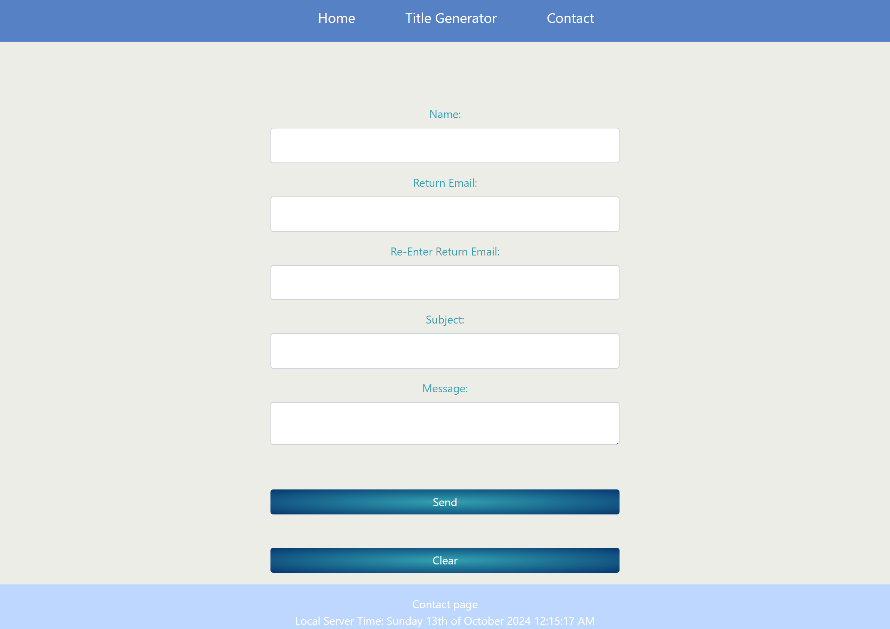
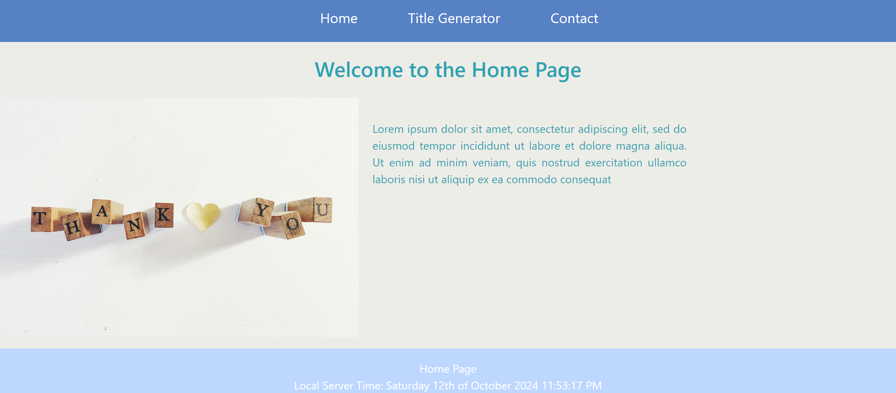

# Email Validation and Form Handling

This project contains a web form that performs client-side validation, including email validation, and offers form clearing functionality. The email validation logic is modular and resides in a separate JavaScript file (`emailValidation.js`) to promote reusability across multiple pages.

## Features

- **Clear Form**: Clears all input fields in the form.
- **Email Validation**: Validates email addresses using a regular expression pattern.
- **Other Validations**: Ensures required fields are filled and no duplicate values for `fictionalPlace` and `realPlace`.
- **Smooth Scroll**: Scrolls to the error message if validation fails.

### Form Screenshot
   
